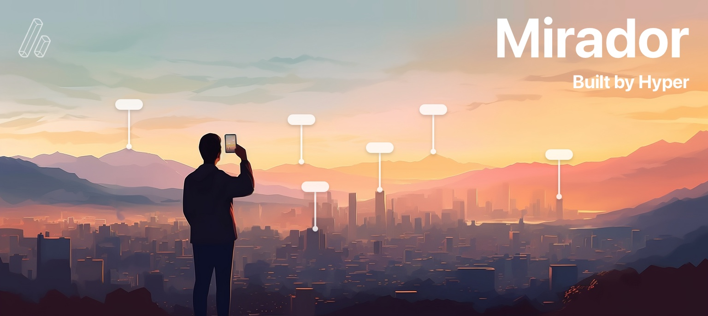

<p align="center">

</p>
</br>

**Mirador makes it easy to build impressive point-of-interest AR experiences on top of Apple’s new AR platform, RealityKit.**

</br>

</br>

Mirador is built by [Andrew Hart](https://twitter.com/andrewhartar), who pioneered AR navigation and built the largest open-source project for Apple’s first AR platform, ARKit. Andrew is now founder of [Hyper](https://HyperAR.com), bringing the same technology to retail stores.

## What is Mirador
There are many use-cases for highlighting points of interest on a skyline in AR: tourism apps, mountain ranges, city viewpoints, observation decks etc.. I receive messages quite often from people who used my first library, asking "How do I do this? There are still some technical challenges in the way."

Here's the problem: RealityKit, and AR in general, is location-agnostic. It tracks device motion in xyz, like a video game, but doesn’t hold the concept of GPS or real-world location.

Adding to this challenge, the GPS and compass in phones is also infamously bad - everyone knows the experience of walking in the wrong direction down a busy street because your phone didn’t know where you were or which direction you were facing. Imagine trying to highlight points of interest in AR, while the location is off by 10m and the device heading is off by 90º.

Mirador solves all of this. It uses a visual anchor to understand the device location, and then takes care of displaying AR elements in the right place.

## How it works
Mirador uses a visual anchor, provided by the developer, to understand the user’s location. At most viewpoints, there are informational boards, or other landmarks that can be used as visual anchors. It builds on RealityKit’s existing ImageAnchor system, for recognising 2D images.

The library then takes care of displaying points interest in the right place, also provided by the developer. There are also a few extra features thrown in to make it a great spatial experience.

## Install using Swift Package Manager
* File > Swift Packages > Add Package Dependency
* Add https://github.com/HyperARCo/Mirador.git

## Setup
There are three steps:
1. Setup Points of Interest (POIs) - you can do this in code, or with JSON
2. Provide an anchor image
3. Run MiradorView

## Setup POIs with code
You can setup a Mirador experience with some boilerplate code:
```
import Mirador

//Setup the anchor
let anchorLocation = Location(coordinate: Coordinate(latitude: 51.47787836, longitude: -0.00084588), altitude: 46)
let locationAnchor = LocationAnchor(name: "greenwich", physicalWidth: 0.5, location: anchorLocation, bearing: Float(-30).degreesToRadians, orientation: .horizontal)

//Setup a few points of interest
let canaryWharfCoordinate = Coordinate(latitude: 51.50493780, longitude: -0.01948017)
let canaryWharfLocation = Location(coordinate: canaryWharfCoordinate, altitude: 50)
let canaryWharfPOI = PointOfInterest(name: "Canary Wharf", location: canaryWharfLocation)
locationAnchor.pointsOfInterest.append(canaryWharfPOI)

let o2Coordinate = Coordinate(latitude: 51.50296112, longitude: 0.00321850)
let o2Location = Location(coordinate: o2Coordinate, altitude: 50)
let o2POI = PointOfInterest(name: "O2 Arena", location: o2Location)
locationAnchor.pointsOfInterest.append(o2POI)

let miradorView = MiradorView(locationAnchor: locationAnchor)
miradorView.run()
```


## Setup POIs with JSON
Once you have more than a few points of interest, writing all of this out can be cumbersome. Mirador also supports setting up the whole experience from a JSON file. Here’s the JSON file you’ll need for the same experience:
```
{
    "anchor": {
        "name": "greenwich",
        "physical_width": 0.5,
        "coordinate": [-0.00084588, 51.47787836], //[long, lat]
        "altitude": 46.0,
        "bearing_degrees": -30,
        "orientation": "vertical" //"vertical" or "horizontal"
    },
    "points_of_interest": [
        {
            "name": "Canary Wharf",
            "coordinate": [-0.01948017, 51.50493780],
            "altitude": 235
        },
        {
            "name": "O2 Arena",
            "coordinate": [0.00321850, 51.50296112],
            "altitude": 52
        }
    },
    "version": "1.0"
}
```

You can use this JSON like this:
```
if let path = Bundle.main.path(forResource: “greenwich”, ofType: “.json”) {
    let anchor = LocationAnchor.anchorFromFile(atPath: path)

    let miradorView = MiradorView(locationAnchor: locationAnchor)
    miradorView.run()
}
```

## Provide an anchor image
Add a clear image of the anchor to your Assets, with the same name specified in the LocationAnchor.name.

Try and take the image face-on, without any shadows or harsh reflections. Perspective transforming the image to be perfect doesn't work - in my testing, RealityKit doesn't recognise images that have been skewed. An image *designed to be an anchor* (such as a QR code) could work best, and could also be seen as a good marketing opportunity, e.g. an image which promotes the app, and is also the anchor.

## Final setup steps
If you’re using SwiftUI, you can instantiate in mostly the same way, by using `MiradorViewContainer(locationAnchor: locationAnchor)`.

Call `miradorView.run()` when the experience is launched or brought back to the foreground, and `miradorView.pause()` when the app is in the background.

Finally, add `NSCameraUsageDescription` to your info.plist, with a description for accessing the camera.

Make sure to run on your device - RealityKit requires the camera and doesn’t work in the Simulator.

## Custom elements
All of the Points of Interest come with a standard out-of-the-box appearance, but you might want to customise this.

### Displaying an image
You can display your own image within the AR space by using `addPOIImage()`:
```
let cityCoordinate = Coordinate(latitude:51.51438463, longitude: -0.08024839)
let cityLocation = Location(coordinate: cityCoordinate, altitude: 200)
let image = UIImage(named: "skyline")!

miradorView.addPOIImage(location: cityLocation, image: image)
```

This supports transparency, so if your image is a PNG that's fine. The AR entity displayed will have ScreenScale and FaceCamera properties:
- ScreenScale: The entity scales to always appear at the size it was designed. If your image is 300x300, it'll appear at 300x300 points on-screen.
- FaceCamera: The entity always faces the camera.

Typically, RealityKit content can appear dimmed, but we've developed a number of advanced rendering techniques, so the images support transparency, drop-shadows and they render with the correct colouring. Dig into `setupRealityKitPlane()` within the source code if you're interested to see how that works.

(Massive thanks to [MaxxFrazer](https://twitter.com/maxxfrazer) for most of this. Yes, I borrowed the number 1 RealityKit developer to help me build this.)

If you want to display your own UI, you can use the SwiftUI `ImageRenderer` API to convert this into an image. Check out the `addPOILabel()` function within Mirador for some sample code.

You can also add a RealityKit `Entity` with the same ScreenScale and FaceCamera, functionality:
```
addPOIEntity(location: Location, entity: Entity)
```

Or you can add a RealityKit Entity without ScreenScale or FaceCamera, but still anchored to a location:
```
addLocationEntity(location: Location, entity: Entity)
```

## Testing the app from home
These experiences are designed to be used at iconic viewpoints, but it’s not practical to be on-site all day while developing your app. Here are some suggestions for improving the development process:

- You can run the experience from home by loading the anchor image on your computer screen, then scanning it with your app. This will let you quickly test if your AR elements are displaying properly, if there are enough/too many etc.
- You can record a RealityKit session, including video feed and AR motion data, using the Reality Composer app.
	- Create a new session, tap the three dots in the top right > Developer > Record AR Session.
	- Record a session, as though you can see the AR elements and are demoing the final app. Make sure to point towards the anchor near the start. You don’t need to enable the location recording in the bottom right, we don’t use that.
	- Tap share, Save to Files. The file will be really big, over 100MB. AirDrop this file once you’re back at your computer. In my experience, if you save the video to Camera Roll, it saves at the same quality but removes the embedded data, and if you try to send it on WhatsApp or another app it compresses it to be much smaller. So make sure to save to Files, or send directly via AirDrop to stop the file from being compressed.
	- In Xcode, with your phone plugged in and selected, go to Edit Scheme… Run > Options > ARKit, and enable Replay data, then select the file. Note: This option won't appear unless you have your phone selected.
	- When you run the app, it’ll playback the video session, and should recognise your anchor image.
	- Note: In my experience, it seems that sessions recoded on LiDAR devices can only be played back on other LiDAR devices, and the same for non-LiDAR devices.

## Sample project
The sample project provides a straightforward implementation which works at *Prime Meridian, Greenwich* (the center of the world!). It demonstrates two ways you can use the library - from code, with some manual elements, or from JSON.

Note: In both cases, the `greenwich` anchor in the sample project is set to horizontal. You can change this to `vertical` if you’re displaying it on your screen. If you’re in Greenwich and trying it in-person, it’ll be horizontal on the ground.

## Known Issues
- Each frame where the anchor is visible, RealityKit updates its position. Sometimes the image can only be seen on the edge of a frame, so RealityKit's update to its position is not as precise, but there's no way to know which are *good* anchor updates. And you can imagine the anchored content can jitter around every time it updates the position of the anchor. So I've implemented a Kalman filter on these position updates, which basically averages out the data and should arrive at the correct heading.

## Next steps
This is v1. There are endless opportunities to take Mirador further. Feel free to fork, and submit PRs with improvements and new features.

## Credit

Mirador was built by [Andrew Hart](https://twitter.com/AndrewHartAR). A common follow-up question I get is "this is great - can this be integrated with retail stores?" That's the purpose of my startup, [Hyper](https://HyperAR.com). Mirador is free, open-source for Point of Interest applications. Hyper is our full indoor spatial platform for retail (indoor maps, precise location, AR navigation etc.)

Massive thanks to [MaxxFrazer](https://twitter.com/maxxfrazer), the king of RealityKit, who helped with many of the rendering issues.

## License
Mirador is available under MIT license.
